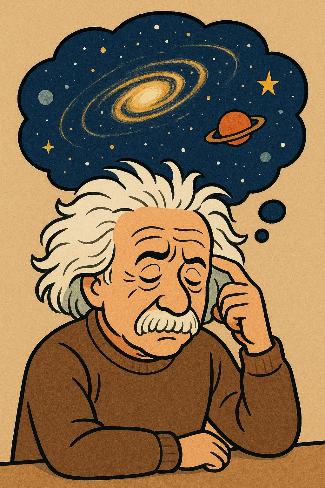

# How do people have ideas?

How could Einstein, sitting at a desk with just pen and paper, develop a theory that describes the strangest events in the universe? This question fascinated me so deeply that I couldn’t resist choosing physics as a career. I was genuinely amazed by how we, humans like you and me, can use our minds to uncover truths about the world we live in. Could I do that too? I had to try. And that is how I became a Ph.D. in physics.

<figure style="text-align: center;">
  
  <figcaption style="font-size: 0.9em; color: black;">Einstein thinking about the universe. Created with ChatGPT.
</figcaption>
</figure>

  I began my physics degree with almost no background in physics or mathematics.

 

My mind was fresh, open, and eager to be filled with science. I still remember learning calculus. What an experience! For the first time, I felt empowered with tools to make predictions. Newton’s laws, combined with techniques for solving differential equations, gave me the ability to understand how to escape Earth’s gravitational pull. Add a few fundamental principles, like the fact that some quantities, like energy or the product of a body’s mass and its velocity, that we call momentum, remain the same before and after a process occurs, and you can grasp how a rocket works. That’s enough, in theory, to get you to the Moon. Incredible! And I was just getting started.

But let’s slow down. As one professor once said, “It’s good to be excited, but it’s not good to be delusional.” Naturally, the journey wasn’t always this exciting ride. It was, and still is, a rollercoaster. Homework, exams, failed experiments, and theoretical misunderstandings are all part of the standard curriculum. This brings me to my second motivation for pursuing physics: curiosity about the reality behind the romanticized image of science. We often hear that only a handful of people have made meaningful contributions to groundbreaking discoveries. I couldn’t accept that. I wanted to see behind the scenes. The raw, daily routine of a scientist and how progress is truly made over time.

After two years of foundational courses, I moved on to advanced topics: quantum mechanics, electromagnetism, statistical mechanics, and classical mechanics. I learned many fascinating things and decided to pursue a master’s degree. I had so many interests that choosing a research topic was never a problem. Instead, I chose based on which advisor I felt I could work best with.

  A turning point

 

Finally, I reached the point my younger self had dreamed of. It was my turn to tackle the big mysteries of the universe. Time to do research. My days became filled with reading papers, asking questions, and trying to find answers that no one has found before. No book can truly prepare you for this. And I was right. The idea of science is far from the experience of doing science. There are so many people behind every breakthrough that I’m still amazed by how little we know about the scientists themselves.

I entered the field of particle physics. My first contact with the topic came through study sessions with my advisor. I was excited, but also a bit intimidated. My master’s research focused on what Frederick Reines, a pioneer in the field, called “the tiniest quantity of reality we could ever imagine”: neutrinos.

Neutrinos were first proposed by Wolfgang Pauli as a “desperate remedy” to a puzzling problem in physics. At the time, physicists were puzzled for over 30 years by beta decay, a process in which a neutron was believed to transform into a proton and an electron. According to conservation of energy, the energy before and after the decay should match. But experiments showed a spread in the energy of emitted electrons not reflected in the calculations. This led some physicists to question whether energy is truly conserved in beta decays. Pauli offered a different explanation: something else was escaping undetected. He proposed the existence of a neutral, nearly massless particle: the neutrino. When this particle is included in the reaction, the energy balance aligns with experimental data. This was a disruptive idea, and its confirmation marked a major breakthrough. 

  The precision era

 

Today, we’re in the “precision era” of neutrino physics. Our technology has advanced to the point where we can not only detect neutrinos but also study their properties in detail. To date, they are the lightest massive particles ever measured. They are also electrically neutral, meaning they don’t interact with electromagnetic fields, and they interact so weakly with matter that detecting them remains a major challenge. Yet, their elusiveness is precisely what makes them so important.

For example, imagine commuting during rush hour, trying to reach the metro door through a dense crowd. The people around you slow you down because you keep bumping into them. It takes you a lot longer to get through the door. This is similar to what happens to photons produced in the Sun’s core. As photons get produced and try to make their way to the Sun’s surface, they can barely travel a few centimeters without interacting with the dense matter in the solar interior (like the crowd blocking the metro door). It is so dense that photons take thousands of years to reach the surface (how lucky you are not to be a photon on your way home). Neutrinos, on the other hand, barely interact with this dense medium. They escape almost immediately, carrying direct information about the solar core. This makes them one of our best tools for studying the Sun’s interior. 

They are also important cosmic messengers. The [KM3NeT experiment](https://www.km3net.org/), a neutrino detector located in the Mediterranean Sea, recently announced the detection of the [most energetic neutrino event](https://www.km3net.org/km3-230213a/the-event/) ever recorded. This discovery helps in establishing a new frontier: studying the universe through the neutrino lens. To put the energy scale in perspective, if we say that the collisions taking place at the biggest human-made particle accelerator, the [Large Hadron Collider](https://home.cern/science/accelerators/large-hadron-collider) in Geneva, Switzerland, are rats, this neutrino event is an enormous cow. The difference is immense, and the source of such a high-energy neutrino remains unknown.
Despite significant progress, many questions remain. For instance, we still don’t know the exact values of neutrino masses or how they acquire mass. Neutrinos pose a challenge to the best description of nature we have so far, called the Standard Model of particle physics.

  This is where my work fits in 

 
As a theoretical physicist working as a postdoc at [Fermilab](https://www.fnal.gov/) and at [Northwestern University](https://www.northwestern.edu/), I aim to tackle these questions. I’ve studied models that explain the origin of neutrino masses, often involving new interactions and complex calculations. I’ve explored how modifications to the Standard Model could lead to novel experimental signatures of neutrino interactions, and recently, I’ve been focused on understanding the possible sources of the KM3NeT ultra-energetic neutrino event.

For all of this, I sit at my desk with a pen, some paper, and a computer. I read articles, test different hypotheses, write calculations, run simulations and most likely hit dead ends. But eventually, I find my way forward. Not alone, of course. Along this journey, I have also confirmed something that should be obvious, though it often is not. Science is a collaborative effort, and any breakthrough involves far more people than any prize can recognize. Nobody spontaneously discovers something out of nothing. We all build on what others have left behind and we do that as a group. We talk a lot. We discuss physics in the corridors, at lunch, in meetings, sometimes even in the bathroom. 

  So, how do people have ideas?

I’ve answered my original question: The truth is, they don’t simply “have” ideas. Ideas are <b><u>handcrafted</u></b>. They emerge from relentless effort, trial and error, deep thinking and endless discussions with collaborators. After many failed attempts, the right path becomes obvious. From the outside, we only see the tip of the iceberg, not the years of dedication underneath it.

<figure style="text-align: center;">
  
  <figcaption style="font-size: 0.9em; color: black;">Scientist handcrafting an idea. Created with ChatGPT.
</figcaption>
</figure>

So next time you’re inspired by a scientific breakthrough, try looking behind the scenes. It is up to you to decide whether the tip of the iceberg is enough for you. I challenge you to dive deeper. But be careful. Go too far, and you will have no choice but to become a researcher. There is peace in ignorance; There is no peace when you have questions.

---

### Acknowledgments:
 This essay was written for the Science Policy & Advocacy for Research Competition (SPARC) at the Universities Research Association.